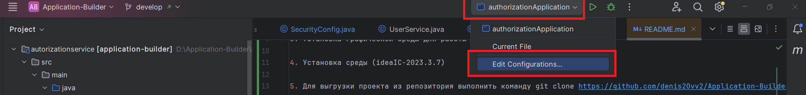
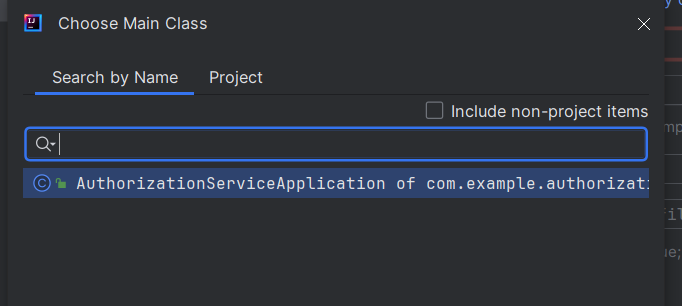

# Application-Builder

Ссылка на утилиты: https://disk.yandex.ru/d/5WZudjxqOaKm7Q

## 1. Установка java (файл: jdk-17.0.12_windows-x64_bin)

## 2. Установка БД (файл postgresql-17.0-rc1-windows-x64)

В процессе установки выбрать следующие логин и пароль для супер юзера:
username=postgres
password=123456

## 3. Установка графической среды для работы с БД Pgadmin (pgadmin4-8.11-x64)

## 4. Установка среды (ideaIC-2023.3.7)

## 5. Для выгрузки проекта из репозитория выполнить команду в консоли из папки проекта
```
git clone https://github.com/denis20vv2/Application-Builder.git
```
```
 git checkout develop
```

## 6. Открыть папку проекта из IntelliJ Idea

## 7. На верхней панели выбрать "edit configurations" -> Затем "edit configurations", в открывшемся окне выбрать "Add new configuration"




затем "Application", выбрать sdk 17 и в поле "main class" прописать "AuthorizationServiceApplication".



По кнопке на верхней панели "Run AuthorizationServiceApplication" можно запустить проект

В случае если вылетит ошибка установки jdk, то на верхней панеели Main menu выбрать File -> Project structure, 
add new sdk -> add jdk -> Указать путь к jdk-17 (Если удобнее можно установить другой пакет: download jdk -. выбрать 17 версию)

##Настройка БД
- Для настройки БД нужно зайти в pgAdmin (при входе на сервер потребуется ввести пароль супер юзера)
- Создать новую БД с названием "application_builder"
- Порт: 5432


